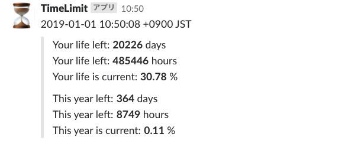

# timelimit

`timelimit` is slack notifier which tells the rest of your life.



## Prerequisites

* AWS account 
* aws-cli

## Usage

1. Clone this repository.

```bash
$ git clone git@github.com:RossyWhite/timelimit.git
```

2. Copy `.env.sample` to `.env`, then configure the settings.

```bash
$ cp .env.sample .env
```

3. Deploy your stack to CloudFormation with the command below.

```bash
$ make deploy
```

If you want to delete the stack, 

```bash
$ make delete
```
